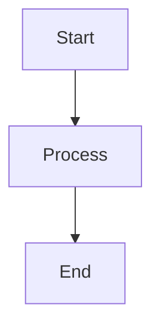

# PAAM Layer 4: Full Stack Integration

> **Status:** Ready for opencode session #4
> **Goal:** SQLite logging, nightly adaptation, memory integration, final integration

---

## 1. Prerequisites

- ✅ Layer 1 completed (AnythingLLM + Ollama)
- ✅ Layer 2 completed (AgentScope agents)
- ✅ Layer 3 completed (TTS + Avatar + Frontend)

---

## 2. Project Structure

```
paam/
├── 01_rag_knowledge/
├── 02_agents/
├── 03_avatar/
├── 04_fullstack/            # This layer
│   ├── db/
│   │   ├── database.py       # SQLite setup
│   │   └── migrations/
│   ├── storage/
│   │   └── chat_logs.db
│   ├── nightly/
│   │   ├── adapter.py        # Nightly adaptation
│   │   └── scheduler.py      # Cron scheduler
│   ├── cheatsheet/
│   │   └── generator.py      # Cheatsheet generator
│   ├── visualization/
│   │   └── mermaid.py       # Mermaid diagram generator
│   ├── integration/
│   │   └── main.py           # Main entry point
│   ├── docker-compose.yml
│   └── .env
└── ...
```

---

## 3. SQLite Database Setup

### 3.1 Database Schema

```python
# db/database.py

import sqlite3
from pathlib import Path
from datetime import datetime
from typing import List, Dict, Any, Optional

class PADatabase:
    """SQLite database for PAAM session logs and analytics"""
    
    def __init__(self, db_path: str = "./storage/chat_logs.db"):
        self.db_path = Path(db_path)
        self.db_path.parent.mkdir(parents=True, exist_ok=True)
        self._init_db()
    
    def _init_db(self):
        """Initialize database schema"""
        with sqlite3.connect(self.db_path) as conn:
            conn.execute("""
                CREATE TABLE IF NOT EXISTS sessions (
                    id INTEGER PRIMARY KEY AUTOINCREMENT,
                    session_id TEXT UNIQUE NOT NULL,
                    topic TEXT NOT NULL,
                    started_at TIMESTAMP DEFAULT CURRENT_TIMESTAMP,
                    ended_at TIMESTAMP,
                    time_limit_minutes INTEGER,
                    topics_covered TEXT,  -- JSON array
                    questions_count INTEGER DEFAULT 0,
                    completed BOOLEAN DEFAULT FALSE
                )
            """)
            
            conn.execute("""
                CREATE TABLE IF NOT EXISTS messages (
                    id INTEGER PRIMARY KEY AUTOINCREMENT,
                    session_id TEXT NOT NULL,
                    role TEXT NOT NULL,  -- 'user' or 'assistant'
                    content TEXT NOT NULL,
                    timestamp TIMESTAMP DEFAULT CURRENT_TIMESTAMP,
                    response_time_ms INTEGER,
                    FOREIGN KEY (session_id) REFERENCES sessions(session_id)
                )
            """)
            
            conn.execute("""
                CREATE TABLE IF NOT EXISTS confusion_flags (
                    id INTEGER PRIMARY KEY AUTOINCREMENT,
                    session_id TEXT NOT NULL,
                    concept TEXT NOT NULL,
                    timestamp TIMESTAMP DEFAULT CURRENT_TIMESTAMP,
                    resolved BOOLEAN DEFAULT FALSE,
                    FOREIGN KEY (session_id) REFERENCES sessions(session_id)
                )
            """)
            
            conn.execute("""
                CREATE TABLE IF NOT EXISTS quiz_results (
                    id INTEGER PRIMARY KEY AUTOINCREMENT,
                    session_id TEXT NOT NULL,
                    question TEXT NOT NULL,
                    correct BOOLEAN NOT NULL,
                    attempts INTEGER DEFAULT 1,
                    timestamp TIMESTAMP DEFAULT CURRENT_TIMESTAMP,
                    FOREIGN KEY (session_id) REFERENCES sessions(session_id)
                )
            """)
            
            conn.execute("""
                CREATE INDEX IF NOT EXISTS idx_messages_session 
                ON messages(session_id)
            """)
            
            conn.execute("""
                CREATE INDEX IF NOT EXISTS idx_confusion_session 
                ON confusion_flags(session_id)
            """)
    
    # Session methods
    def create_session(self, session_id: str, topic: str, time_limit: int) -> int:
        """Create a new session"""
        with sqlite3.connect(self.db_path) as conn:
            conn.execute("""
                INSERT INTO sessions (session_id, topic, time_limit_minutes)
                VALUES (?, ?, ?)
            """, (session_id, topic, time_limit))
            return conn.execute("SELECT last_insert_rowid()").fetchone()[0]
    
    def end_session(self, session_id: str, topics_covered: List[str]):
        """Mark session as completed"""
        with sqlite3.connect(self.db_path) as conn:
            conn.execute("""
                UPDATE sessions 
                SET ended_at = CURRENT_TIMESTAMP,
                    completed = TRUE,
                    topics_covered = ?,
                    questions_count = (
                        SELECT COUNT(*) FROM messages 
                        WHERE session_id = ? AND role = 'user'
                    )
                WHERE session_id = ?
            """, (','.join(topics_covered), session_id, session_id))
    
    # Message methods
    def log_message(self, session_id: str, role: str, content: str, 
                   response_time_ms: int = None):
        """Log a chat message"""
        with sqlite3.connect(self.db_path) as conn:
            conn.execute("""
                INSERT INTO messages (session_id, role, content, response_time_ms)
                VALUES (?, ?, ?, ?)
            """, (session_id, role, content, response_time_ms))
    
    # Confusion tracking
    def log_confusion(self, session_id: str, concept: str):
        """Log a confusion flag"""
        with sqlite3.connect(self.db_path) as conn:
            conn.execute("""
                INSERT INTO confusion_flags (session_id, concept)
                VALUES (?, ?)
            """, (session_id, concept))
    
    def get_unresolved_confusion(self) -> List[Dict[str, Any]]:
        """Get all unresolved confusion flags"""
        with sqlite3.connect(self.db_path) as conn:
            conn.row_factory = sqlite3.Row
            return [dict(row) for row in conn.execute("""
                SELECT * FROM confusion_flags WHERE resolved = FALSE
            """).fetchall()]
    
    def resolve_confusion(self, concept: str):
        """Mark confusion as resolved"""
        with sqlite3.connect(self.db_path) as conn:
            conn.execute("""
                UPDATE confusion_flags 
                SET resolved = TRUE 
                WHERE concept = ?
            """, (concept,))
    
    # Quiz results
    def log_quiz_result(self, session_id: str, question: str, correct: bool, 
                       attempts: int = 1):
        """Log quiz result"""
        with sqlite3.connect(self.db_path) as conn:
            conn.execute("""
                INSERT INTO quiz_results (session_id, question, correct, attempts)
                VALUES (?, ?, ?, ?)
            """, (session_id, question, correct, attempts))
    
    # Analytics
    def get_session_stats(self, session_id: str) -> Dict[str, Any]:
        """Get statistics for a session"""
        with sqlite3.connect(self.db_path) as conn:
            conn.row_factory = sqlite3.Row
            session = conn.execute("""
                SELECT * FROM sessions WHERE session_id = ?
            """, (session_id,)).fetchone()
            
            messages = conn.execute("""
                SELECT COUNT(*) as count FROM messages WHERE session_id = ?
            """, (session_id,)).fetchone()
            
            confusion = conn.execute("""
                SELECT COUNT(*) as count FROM confusion_flags 
                WHERE session_id = ? AND resolved = FALSE
            """, (session_id,)).fetchone()
            
            return {
                "session": dict(session) if session else None,
                "message_count": messages["count"],
                "confusion_count": confusion["count"]
            }
    
    def get_all_confusion_concepts(self) -> List[str]:
        """Get all concepts that caused confusion"""
        with sqlite3.connect(self.db_path) as conn:
            return [row[0] for row in conn.execute("""
                SELECT DISTINCT concept FROM confusion_flags 
                WHERE resolved = FALSE
            """).fetchall()]
    
    def get_quiz_trend(self, days: int = 7) -> List[Dict[str, Any]]:
        """Get quiz score trend over days"""
        with sqlite3.connect(self.db_path) as conn:
            conn.row_factory = sqlite3.Row
            return [dict(row) for row in conn.execute("""
                SELECT DATE(timestamp) as date, 
                       AVG(CASE WHEN correct THEN 1.0 ELSE 0.0 END) as score
                FROM quiz_results
                WHERE timestamp >= DATE('now', '-' || ? || ' days')
                GROUP BY DATE(timestamp)
                ORDER BY date
            """, (days,)).fetchall()]


# Singleton
db = PADatabase()
```

---

## 4. Cheatsheet Generator

```python
# cheatsheet/generator.py

from typing import List, Dict
import requests

class CheatsheetGenerator:
    """Generate cheatsheets from study material"""
    
    def __init__(self, ollama_url: str = "http://localhost:11434"):
        self.ollama_url = ollama_url
        self.model = "llama3.1:70b"
    
    def generate(self, topic: str, context: str) -> str:
        """Generate a cheatsheet for the topic"""
        
        prompt = f"""You are an expert teacher. Create a concise cheatsheet for "{topic}".

Requirements:
- Use markdown format
- Include: key concepts, formulas, mnemonics, common pitfalls
- Use tables for comparisons
- Include 1-line analogies where helpful
- Fit on one A4 page (mentally)
- Use **bold** for emphasis

Context from study material:
{context}

Cheatsheet:"""

        response = requests.post(
            f"{self.ollama_url}/api/generate",
            json={
                "model": self.model,
                "prompt": prompt,
                "stream": False,
                "options": {
                    "temperature": 0.3,
                    "num_predict": 800
                }
            }
        )
        
        if response.status_code == 200:
            return response.json().get("response", "")
        else:
            return "Error generating cheatsheet"


# Singleton
cheatsheet_gen = CheatsheetGenerator()
```

---

## 5. Visualization Generator

```python
# visualization/mermaid.py

from typing import List
import requests

class MermaidGenerator:
    """Generate Mermaid diagrams from concepts"""
    
    def __init__(self, ollama_url: str = "http://localhost:11434"):
        self.ollama_url = ollama_url
        self.model = "llama3.1:70b"
    
    def generate_flowchart(self, concept: str, steps: List[str]) -> str:
        """Generate a flowchart"""
        
        steps_md = "\n".join([f"    {i+1}[{step}]" for i, step in enumerate(steps)])
        connections = "\n".join([f"    {i+1} --> {i+2}" for i in range(len(steps)-1)])
        
        return f"""```mermaid
flowchart TD
{steps_md}
{connections}
```"""
    
    def generate_mindmap(self, topic: str, subtopics: List[str]) -> str:
        """Generate a mind map"""
        
        subtopics_md = "\n".join([f"      - {s}" for s in subtopics])
        
        return f"""```mermaid
mindmap
  root(( {topic} ))
{subtopics_md}
```"""
    
    def generate_sequence(self, actors: List[str], interactions: List[tuple]) -> str:
        """Generate a sequence diagram"""
        
        actors_md = "\n".join([f"    {actor}" for actor in actors])
        interactions_md = "\n".join([
            f"    {a} -> {b}: {desc}" for a, b, desc in interactions
        ])
        
        return f"""```mermaid
sequenceDiagram
{actors_md}
{interactions_md}
```"""
    
    def generate_from_llm(self, concept: str) -> str:
        """Generate diagram using LLM"""
        
        prompt = f"""Create a Mermaid diagram for: {concept}

Output ONLY valid Mermaid code, no explanation.
Choose the best diagram type (flowchart, mindmap, sequence, class, state).

Example:

"""

        response = requests.post(
            f"{self.ollama_url}/api/generate",
            json={
                "model": self.model,
                "prompt": prompt,
                "stream": False,
                "options": {"temperature": 0.3, "num_predict": 500}
            }
        )
        
        if response.status_code == 200:
            return response.json().get("response", "")
        return "Error generating diagram"


# Singleton
mermaid_gen = MermaidGenerator()
```

---

## 6. Nightly Adaptation

### 6.1 Student Profile Updater

```python
# nightly/adapter.py

import json
from datetime import datetime, timedelta
from pathlib import Path
from typing import Dict, Any
from ..db.database import db

class NightlyAdapter:
    """Nightly job to adapt student profile based on interaction data"""
    
    def __init__(self, profile_path: str = "./storage/student_profile.json"):
        self.profile_path = Path(profile_path)
        self.profile_path.parent.mkdir(parents=True, exist_ok=True)
        self.profile = self._load_profile()
    
    def _load_profile(self) -> Dict[str, Any]:
        """Load current student profile"""
        if self.profile_path.exists():
            with open(self.profile_path) as f:
                return json.load(f)
        
        return {
            "style": "reading",
            "mastery_rate": 0.0,
            "weak_concepts": [],
            "confusion_history": [],
            "quiz_scores": [],
            "session_count": 0,
            "prompt_version": 1,
            "last_updated": None
        }
    
    def _save_profile(self):
        """Save updated profile"""
        self.profile["last_updated"] = datetime.now().isoformat()
        with open(self.profile_path, 'w') as f:
            json.dump(self.profile, f, indent=2)
    
    def analyze_and_update(self):
        """Main nightly analysis and update function"""
        
        # 1. Get confusion concepts
        confusion_concepts = db.get_all_confusion_concepts()
        
        # 2. Get quiz trend
        quiz_trend = db.get_quiz_trend(days=7)
        
        # 3. Detect learning style (simplified)
        # In production: analyze message patterns
        # - Many "explain visually" → visual
        # - Many voice replays → auditory
        # - Many step-by-step requests → kinesthetic
        
        # 4. Calculate new mastery rate
        new_mastery = 0.0
        if quiz_trend:
            new_mastery = sum([q["score"] for q in quiz_trend]) / len(quiz_trend)
        
        # 5. Update profile
        self.profile["weak_concepts"] = confusion_concepts
        self.profile["mastery_rate"] = new_mastery
        
        # Update style if enough data (simplified)
        # In production: use ML-based style detection
        
        # Bump prompt version
        self.profile["prompt_version"] += 1
        
        self._save_profile()
        
        return {
            "updated": True,
            "new_mastery": new_mastery,
            "weak_concepts": confusion_concepts,
            "prompt_version": self.profile["prompt_version"]
        }
    
    def detect_learning_style(self) -> str:
        """Detect learning style from interaction patterns"""
        
        # Simplified: check recent message patterns
        # In production: more sophisticated analysis
        
        return self.profile.get("style", "reading")


# Singleton
nightly_adapter = NightlyAdapter()
```

### 6.2 Scheduler

```python
# nightly/scheduler.py

import schedule
import time
import threading
from .adapter import nightly_adapter
from ..db.database import db

def run_nightly_job():
    """Execute nightly adaptation job"""
    print("🌙 Running nightly adaptation...")
    
    try:
        result = nightly_adapter.analyze_and_update()
        print(f"✅ Nightly adaptation complete: {result}")
    except Exception as e:
        print(f"❌ Nightly adaptation failed: {e}")


def start_scheduler():
    """Start the scheduler in background thread"""
    
    # Schedule for 2 AM daily
    schedule.every().day.at("02:00").do(run_nightly_job)
    
    def run_schedule():
        while True:
            schedule.run_pending()
            time.sleep(60)  # Check every minute
    
    thread = threading.Thread(target=run_schedule, daemon=True)
    thread.start()
    
    print("📅 Scheduler started - nightly job at 2:00 AM")


# Manual trigger for testing
if __name__ == "__main__":
    run_nightly_job()
```

---

## 7. Full Integration Main Entry

```python
# integration/main.py

import os
import sys
from pathlib import Path

# Add parent to path
sys.path.insert(0, str(Path(__file__).parent.parent))

from chainlit import cl
from agentscope.agents.teacher import TeacherAgent
from db.database import PADatabase
from cheatsheet.generator import cheatsheet_gen
from visualization.mermaid import mermaid_gen
from nightly.adapter import nightly_adapter
from nightly.scheduler import start_scheduler

# Initialize
db = PADatabase()
teacher_agent = None

@cl.on_chat_start
async def start():
    """Initialize on chat start"""
    global teacher_agent
    
    # Initialize teacher agent
    teacher_agent = TeacherAgent()
    
    # Start nightly scheduler (in background)
    start_scheduler()
    
    await cl.Message(
        content="""🎓 **PAAM - Full System Ready!**

All systems integrated:
✅ RAG Knowledge Base
✅ Multi-Agent System  
✅ TTS Voice Output
✅ Talking Avatar
✅ SQLite Logging
✅ Nightly Adaptation

Type /help for available commands."""
    ).send()


@cl.on_message
async def handle_message(message: cl.Message):
    """Handle messages with full integration"""
    
    global teacher_agent
    user_input = message.content
    
    # Commands
    if user_input.startswith("/"):
        await handle_command(user_input)
        return
    
    # Log to database
    import time
    start_time = time.time()
    
    # Process through teacher agent
    response = teacher_agent.chat(user_input)
    
    # Log message
    response_time = int((time.time() - start_time) * 1000)
    db.log_message(teacher_agent.session.session_id, "user", user_input, response_time)
    db.log_message(teacher_agent.session.session_id, "assistant", response, response_time)
    
    # Check for confusion
    confusion_signals = ["don't understand", "confused", "don't get it"]
    if any(s in user_input.lower() for s in confusion_signals):
        db.log_confusion(teacher_agent.session.session_id, user_input)
        teacher_agent.student.update_profile(confusion=user_input)
    
    # Send response
    await cl.Message(content=response).send()


async def handle_command(command: str):
    """Handle slash commands"""
    
    global teacher_agent
    
    if command == "/cheatsheet":
        # Generate cheatsheet
        topic = "Current Topic"  # Get from session
        # In production: retrieve relevant context
        cheatsheet = cheatsheet_gen.generate(topic, "Generate from RAG context")
        await cl.Message(content=f"📝 **Cheatsheet**\n\n{cheatsheet}").send()
    
    elif command == "/diagram":
        # Generate diagram
        diagram = mermaid_gen.generate_from_llm("neural network")
        await cl.Message(content=diagram).send()
    
    elif command == "/adapt":
        # Manual trigger adaptation
        result = nightly_adapter.analyze_and_update()
        await cl.Message(content=f"🔄 **Adaptation Complete**\n\n{result}").send()
    
    elif command == "/stats":
        # Show session stats
        stats = db.get_session_stats(teacher_agent.session.session_id)
        await cl.Message(content=f"📊 **Session Stats**\n\n{stats}").send()
    
    elif command == "/confusion":
        # Show confusion concepts
        confusion = db.get_all_confusion_concepts()
        await cl.Message(content=f"❓ **Weak Concepts**\n\n{', '.join(confusion) or 'None'}").send()
    
    else:
        # Fall back to basic handler
        await handle_basic_command(command)


async def handle_basic_command(command: str):
    """Basic commands from Layer 3"""
    # Import and call from Layer 3
    pass


if __name__ == "__main__":
    import chainlit
    chainlit.run()
```

---

## 8. Docker Compose (Final)

```yaml
# docker-compose.yml

version: '3.9'

services:
  # Layer 1: RAG
  ollama:
    image: ollama/ollama:latest
    container_name: paam_ollama
    ports:
      - "11434:11434"
    volumes:
      - ./01_rag_knowledge/data/ollama:/root/.ollama
    deploy:
      resources:
        reservations:
          devices:
            - driver: nvidia
              count: 1
              capabilities: [gpu]
    restart: unless-stopped

  anythingllm:
    image: mintplexlabs/anythingllm:latest
    container_name: paam_anythingllm
    ports:
      - "3001:3001"
    volumes:
      - ./01_rag_knowledge/data/anythingllm:/app/server/storage
    environment:
      - OLLAMA_BASE_URL=http://ollama:11434
      - LLM_PROVIDER=ollama
      - LLM_MODEL=llama3.1:70b
    depends_on:
      - ollama

  chroma:
    image: chromadb/chroma:latest
    container_name: paam_chroma
    ports:
      - "8000:8000"
    volumes:
      - ./01_rag_knowledge/data/chroma:/chroma/chroma
    restart: unless-stopped

  # Layer 2: Agents
  agentscope:
    build: ../02_agents
    container_name: paam_agentscope
    ports:
      - "5000:5000"
    volumes:
      - ./04_fullstack/storage:/app/storage
    environment:
      - ANYTHINGLLM_URL=http://anythingllm:3001
      - OLLAMA_URL=http://ollama:11434
    depends_on:
      - anythingllm
      - ollama
    deploy:
      resources:
        reservations:
          devices:
            - driver: nvidia
              count: 1
              capabilities: [gpu]

  # Layer 3 + 4: Frontend (includes Layer 4 integration)
  frontend:
    build: ../03_avatar/frontend
    container_name: paam_frontend
    ports:
      - "8000:8000"
    volumes:
      - ./04_fullstack/storage:/app/storage
    environment:
      - ANYTHINGLLM_URL=http://anythingllm:3001
      - OLLAMA_URL=http://ollama:11434
      - USE_LOCAL_TTS=true
    depends_on:
      - agentscope
      - anythingllm
    deploy:
      resources:
        reservations:
          devices:
            - driver: nvidia
              count: 1
              capabilities: [gpu]

  # Database (SQLite - file based)
  # Note: SQLite runs in frontend container

networks:
  default:
    name: paam_network
```

---

## 9. Running the Full System

### 9.1 Quick Start

```bash
# From paam root directory
docker-compose -f 04_fullstack/docker-compose.yml up -d
```

### 9.2 Verify All Layers

```bash
# Check all containers
docker ps

# Test each endpoint
curl http://localhost:3001/api/health      # AnythingLLM
curl http://localhost:11434/api/tags       # Ollama
curl http://localhost:8000                # Frontend
```

### 9.3 Access PAAM

```
http://localhost:8000
```

---

## 10. Testing Checklist

### Layer 1: RAG ✅
- [ ] AnythingLLM loads at localhost:3001
- [ ] Can upload PDF/YouTube
- [ ] Chat with document works

### Layer 2: Agents ✅
- [ ] Teacher Agent responds
- [ ] Student profile updates
- [ ] Session tracking works

### Layer 3: Avatar ✅
- [ ] TTS generates audio
- [ ] Chainlit frontend loads
- [ ] Voice output works

### Layer 4: Full Integration ✅
- [ ] SQLite logs messages
- [ ] Cheatsheet generates
- [ ] Mermaid diagrams render
- [ ] Nightly adapter runs
- [ ] `/stats` shows session data
- [ ] `/adapt` triggers update

---

## 11. Complete Command Reference

| Command | Description |
|---------|-------------|
| `/start` | Begin learning session |
| `/end` | End session |
| `/voice on` | Enable TTS |
| `/voice off` | Disable TTS |
| `/quiz [topic]` | Start quiz |
| `/cheatsheet` | Generate summary |
| `/diagram` | Generate diagram |
| `/style` | Show learning style |
| `/mastery` | Show mastery rate |
| `/stats` | Session statistics |
| `/adapt` | Trigger nightly adaptation |
| `/confusion` | Show weak concepts |
| `/help` | Show all commands |

---

## 12. File Summary

| File | Purpose |
|------|---------|
| `db/database.py` | SQLite for chat logs, quizzes, confusion |
| `cheatsheet/generator.py` | LLM-powered cheatsheet creation |
| `visualization/mermaid.py` | Mermaid diagram generation |
| `nightly/adapter.py` | Student profile adaptation |
| `nightly/scheduler.py` | Cron scheduler for nightly jobs |
| `integration/main.py` | Main entry point |

---

## 13. Next Steps (Beyond v1.0)

- Multi-user support
- Mobile app
- Fine-tuned LLM models
- Auto-curriculum generation
- Advanced analytics dashboard

---

*Layer 4 Complete ✅*
*PAAM Full System Ready! 🎉*
